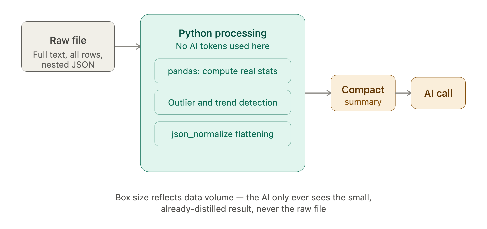

# AgentDesk

> 🚧 **Work in progress.** AgentDesk is under active development — features, APIs, and UI may change without notice. Currently a personal/daily-use tool, not a finished product.

An agentic AI-powered toolkit that ingests documents and spreadsheets, then runs selectable AI-driven transformations to generate structured outputs — UAT test specifications, document summaries, data analytics, and JSON table extraction.

**Live at:** [agents-desk.com](https://agents-desk.com)

## What it does

Upload a file, pick a function, get a result:

- **SRS Document → UAT Test Spec** — upload a Software Requirements Specification (PDF, Word, PowerPoint, or plain text), and AgentDesk extracts testable requirements and generates a structured set of UAT test cases (steps, expected results, priority), exportable to Excel.
- **Document → Summary** — salient points, an identified "red thread" (or an honest "none found"), and concrete takeaways from any document.
- **CSV/Excel → Data Analytics** — computes real statistics (via pandas), then uses AI to generate plain-language insights, chart recommendations, outlier detection, and simple trend forecasts, rendered as live charts (bar, line, pie, scatter). Reports can be shared via a read-only link.
- **JSON → Flattened Tables** — auto-detects array-of-objects fields in a JSON file and flattens each into its own table, with AI curating the most relevant columns per table. Exports as a multi-sheet Excel workbook.

## Tech stack

- **Backend:** FastAPI (Python) — async, Pydantic-validated
- **Frontend:** React + Vite, React Router for client-side routing, recharts for data visualization
- **AI:** Anthropic Claude (primary), OpenAI (automatic silent fallback) — both accessed via tool-calling (forced structured output), not free-text prompting
- **Data:** pandas, openpyxl, python-docx, python-pptx, pdfplumber for parsing
- **Hosting:** Railway (backend + frontend as separate services), Cloudflare (domain + DNS)

## Supported file formats

| Category | Formats |
|---|---|
| Document | `.pdf` (text-based only, no OCR), `.docx`, `.pptx`, `.txt` |
| Table | `.csv`, `.xlsx`, `.xls` |
| Structured | `.json` |

## Project structure

```
AgentDesk/
├── backend/
│   └── app/
│       ├── main.py                 # FastAPI entrypoint, router mounting, CORS
│       ├── config.py                # API keys, model config
│       ├── routers/                 # HTTP endpoints
│       │   ├── ingest.py            # file upload
│       │   └── functions/           # one router per AI function
│       ├── parsers/                 # file → ParsedDocument/ParsedTable/ParsedStructured
│       ├── schemas/                 # Pydantic models (request/response contracts)
│       ├── functions/               # generation logic per function (AI-driven or deterministic)
│       └── services/
│           ├── ai_client.py         # provider-agnostic Claude/OpenAI wrapper (text + tool calls)
│           ├── file_storage.py      # temp file handling
│           ├── job_store.py         # in-memory upload-session tracking
│           └── share_store.py       # in-memory shareable-link storage
│
└── frontend/
    └── src/
        ├── App.jsx                  # route definitions
        ├── MainApp.jsx               # main upload/generate workflow
        ├── pages/                    # standalone routed pages (e.g. shared report view)
        ├── components/                # UploadZone, FilePreviewCard, results views, etc.
        └── api/client.js              # fetch wrappers to the backend
```

## Architecture notes

- **Ingestion is decoupled from function logic.** Every file is parsed into one of three shapes (`ParsedDocument`, `ParsedTable`, `ParsedStructured`) regardless of which function will use it — functions never touch raw files or format-specific parsing.
- **AI calls always go through `ai_client.py`.** Structured outputs are enforced via forced tool-calling (not prompt-based JSON), which is more reliable and mirrors how real agentic tool use works. Anthropic is tried first; if it fails (e.g. rate limit, insufficient credit), the same request silently falls back to OpenAI.
- **Deterministic computation before AI reasoning, where possible.** Analytics doesn't hand raw rows to the AI — pandas computes real statistics (including outlier detection and trend forecasts) first, and the AI reasons over those. JSON flattening works the same way: pandas fully flattens the structure, AI only curates which columns matter.
- **Not every function needs AI.** JSON flattening's core transformation is pure pandas — AI is used only for the column-curation step, not the extraction itself.
- **Deterministic Python does the heavy lifting, not the AI.** Every function leans on plain code — pandas for statistics, outlier detection, and trend forecasting; `json_normalize` for flattening nested structures — before any AI call happens. The AI only ever receives a small, already-distilled summary (column stats, a curated table shape, extracted text), never the raw file itself. This keeps token usage low and predictable regardless of input size, and it means arithmetic and structural transformations are always exact — never left to chance in a model's output.
## Setup



### Prerequisites
- Python 3.10+
- Node.js + npm

### Backend

```bash
cd backend
python -m venv .venv
source .venv/bin/activate   # Windows: .venv\Scripts\activate
pip install -r requirements.txt
```

Create `backend/.env`:
```
ANTHROPIC_API_KEY=sk-ant-...
OPENAI_API_KEY=sk-...
```
At least one key is required; both enables automatic fallback.

Run:
```bash
uvicorn app.main:app --reload --port 8000
```

### Frontend

```bash
cd frontend
npm install
npm run dev
```

Opens at `http://localhost:5173`.

## Current scope / known limitations

This is an evolving personal tool, with a few deliberate simplifications:

- **No user accounts or auth** — single-session use
- **No file persistence** — uploaded files are temporary, cleaned up after use; nothing survives a backend restart
- **Shareable links are in-memory only** — they stop working if the backend restarts
- **No multi-file runs** — each function operates on one uploaded file at a time
- **PDF support is text-based only** — scanned/image PDFs (no text layer) aren't supported
- **Excel multi-sheet input files** — only the first sheet is read

## Roadmap

- pcap file support (network traffic analysis — protocol breakdown, flow reconstruction, anomaly detection)
- Additional functions (config/document reconciliation, vendor proposal comparison, incident RCA reports)
- Analytics export (Excel/PDF report)
- Real persistence (database + object storage) and user accounts
- Agentic file-fetching (local folder access, cloud drive connectors)

## MCP Agent
Beyond the file-based functions above, AgentDesk includes a generic **MCP agent**: connect any Model Context Protocol server, describe a task in plain language, and the agent autonomously calls that server's tools — searching, fetching, and reasoning across multiple steps — until it produces a synthesized, human-readable answer.

### How it works

User submits (URL, credential, task)
│
▼
Call Anthropic, with the MCP server attached
│
▼
MCP server may be called → tool_use + tool_result blocks
│
▼
stop_reason == "tool_use" ?
│ │
yes no
│ │
▼ ▼
Append history, Return final answer
call again + step log
│
└──── loops back to "Call Anthropic" ────┘

1
1. You provide an MCP server URL, an access credential (API key or OAuth token), and a task description
2. AgentDesk calls Anthropic with that MCP server attached (via the native `mcp_servers` API parameter)
3. Anthropic connects to the server and may call its tools, returning tool-use and tool-result content blocks in the same response
4. AgentDesk checks the response's `stop_reason`: if it's `tool_use`, the full conversation history (including what was just called and returned) is carried forward into another call; otherwise, the response is treated as final
5. The final answer is returned along with a step-by-step log of every tool call made along the way, so the user can see exactly what the agent did — not just what it concluded

The loop has a hard cap (currently 8 iterations) as a safety net against a task that never resolves cleanly.
This is deliberately **read/fetch-oriented and session-only** — no credential is stored, and each run is independent. There's currently no OpenAI fallback for this specific feature, since OpenAI has no equivalent native MCP integration.

### Connecting a new MCP server

1. Find the server's MCP endpoint URL (see table below for common ones, or check the provider's own developer docs)
2. Determine whether it uses a simple API key/token, or full OAuth 2.0
3. **API key servers:** generate a key in the provider's settings and paste it directly into AgentDesk's credential field
4. **OAuth servers:** register an app in the provider's developer console to get client credentials, configure consent scopes (grant only what the task needs), then use a tool like [Google's OAuth Playground](https://developers.google.com/oauthplayground) to complete the consent flow and exchange the authorization code for an access token
5. Test with a small, low-risk, read-only task first before anything more complex
6. Remember OAuth tokens are typically short-lived (often ~1 hour) — expect to refresh periodically for repeated use

### Commonly used MCP servers

| Service | MCP Endpoint | Auth | Setup |
|---|---|---|---|
| **Gmail** | `https://gmailmcp.googleapis.com/mcp/v1` | OAuth 2.0 | [Google's Gmail MCP guide](https://developers.google.com/workspace/gmail/api/guides/configure-mcp-server) |
| **Google Workspace** (Drive, Docs, Sheets, Calendar, etc.) | varies by product | OAuth 2.0 | [Google Workspace MCP guide](https://developers.google.com/workspace/guides/configure-mcp-servers) |
| **GitHub** | `https://api.githubcopilot.com/mcp/` | Personal Access Token (simplest) or OAuth | [GitHub MCP server docs](https://github.com/github/github-mcp-server) |
| **Slack** | `https://mcp.slack.com/mcp` | OAuth 2.0 (via a Slack app you create) | [Slack MCP client docs](https://docs.slack.dev/ai/slackbot-mcp-client/) |
| **Notion** | `https://mcp.notion.com/mcp` | OAuth 2.0 | [Notion's MCP documentation](https://developers.notion.com) |
| **Filesystem, Git, PostgreSQL, SQLite, and other local/reference servers** | self-hosted, run locally | varies | [Official MCP servers repo](https://github.com/modelcontextprotocol/servers) |

Note: some of these (GitHub, PostgreSQL, and others) also have local/self-hosted variants that run via Docker or npx instead of a remote URL — worth checking the linked docs for which mode fits a given use case.